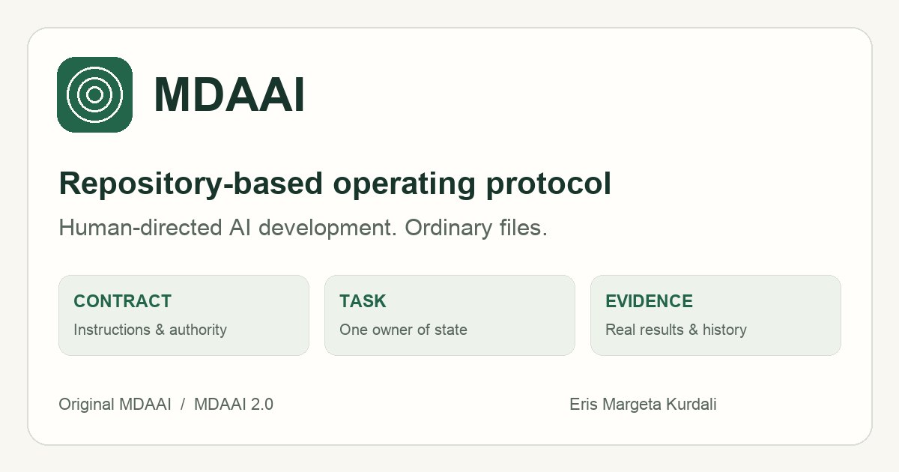
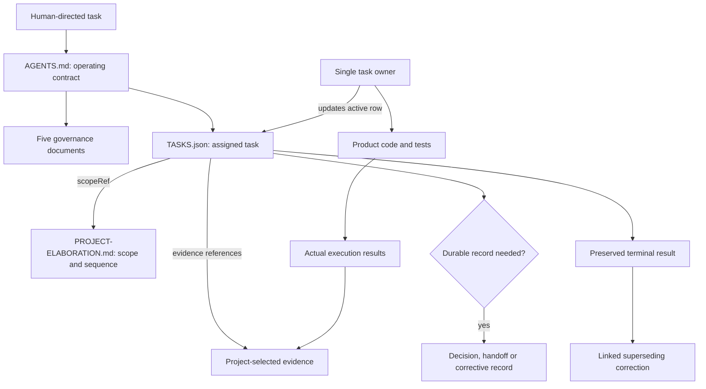
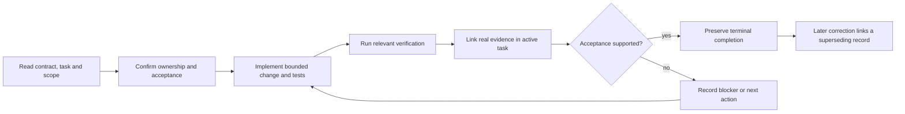
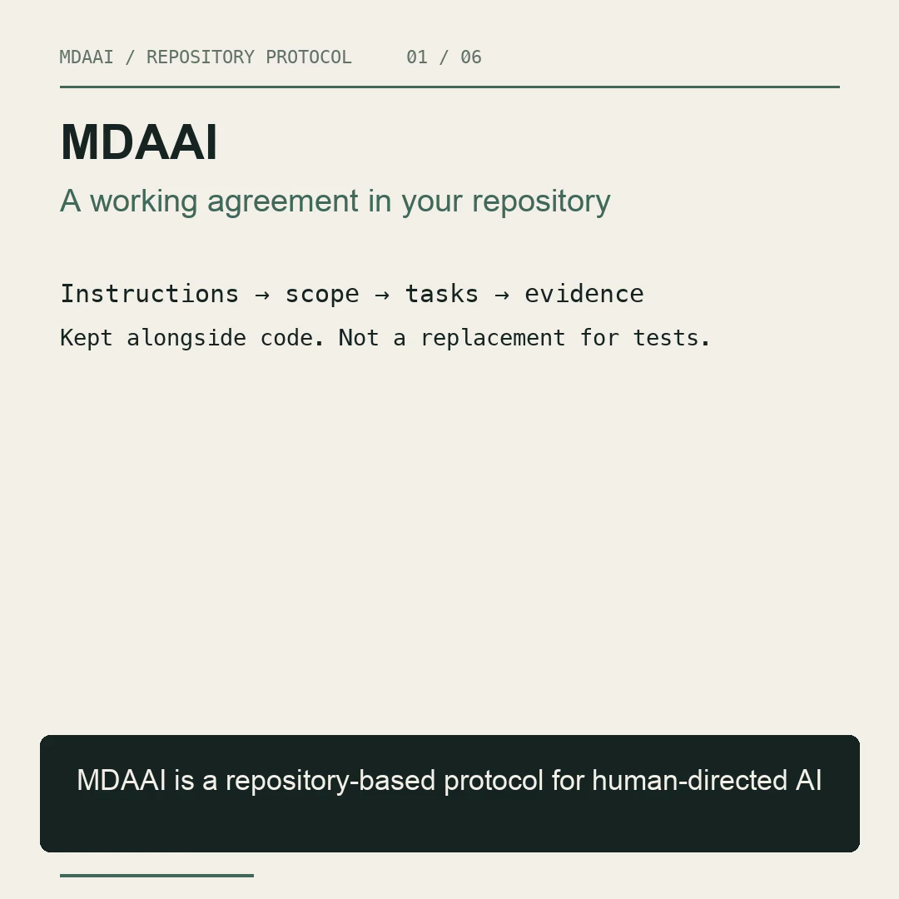

# MDAAI

<p align="center"></p>
<p align="center">
<a href="https://github.com/Eris-Margeta/mdaai/actions/workflows/website.yml"></a>


</p>

**A repository-based operating protocol for human-directed AI development.** Ordinary files define authority, scope, current work, evidence, and recoverable history.

By **Eris Margeta Kurdali** · [Documentation website](https://www.mdaai.internet.technology) · [Watch the explainer](https://www.mdaai.internet.technology/#explainer) · [Rights and inherited notices](LICENSE)

> [!IMPORTANT]
> This is the curated documentation and website source, **not** the private Onion Governance implementation, a universal installer, or proof that an AI agent obeys instructions. The endpoint task in the documentation is illustrative, not a product implementation claim.

## Read the system

| Guide | What it explains |
|:--|:--|
| [MDAAI](https://www.mdaai.internet.technology/) | Definition, continuity, instructions vs enforcement |
| [Repository structure](https://www.mdaai.internet.technology/repository-structure/) | Required/optional/conditional files and information owners |
| [How files work together](https://www.mdaai.internet.technology/how-files-work-together/) | Reading order, read/write responsibilities and recovery |
| [Task lifecycle](https://www.mdaai.internet.technology/task-lifecycle/) | Ordinary task evidence, blocked vs deferred, terminal corrections |
| [Original MDAAI](https://www.mdaai.internet.technology/mdaai-1/) | Work Orders, corrective records, decisions and the editing-rule conflict |
| [MDAAI 2.0](https://www.mdaai.internet.technology/mdaai-2/) | Smaller portable core, fresh registry and project-by-project adoption |

## Two generations, one accountability goal

| | Original MDAAI | MDAAI 2.0 |
|:--|:--|:--|
| Entry | Template instructions and governance protocols | Root `AGENTS.md`; optional `CLAUDE.md` pointer |
| Scope and sequence | Project Elaboration | Project Elaboration |
| Work state | Work Orders and their registry | `TASKS.json`, the single canonical task-state owner |
| Records | WO / CWO / ADR / checkpoint / knowledge artifacts | Durable record when task and evidence alone are insufficient |
| Completion | Records and expected verification | Actual acceptance evidence; preserve terminal results |
| Migration | Reconcile original WO editing-rule conflict | Fresh registry, completed history, pilot acceptance and rollback |

> [!NOTE]
> MDAAI 2.0 reduces routine paperwork, **not accountability**. Local permissions and stronger inherited rules still apply. A structural checker is not semantic acceptance or proof of live adoption.

## How the files connect



### Portable MDAAI 2.0 core

This is the **documented adoption inventory**, not a claim that this website repository installs those governance files.

```text
AGENTS.md                                      operating contract
CLAUDE.md                                      optional pointer only
PROJECT-INTERNAL/
├── GOVERNANCE/
│   ├── AUTHORITY.md                            permissions and boundaries
│   ├── ENGINEERING.md                          engineering obligations
│   ├── EVIDENCE.md                             evidence and acceptance
│   ├── REASONING.md                            coordination and reasoning
│   └── RECORDS.md                              history and supersession
└── MANAGEMENT/
    ├── PROJECT-ELABORATION.md                   scope and sequence
    └── TASKS.json                              task state and next action
```

Architecture and other durable records are conditional. Product, test and evidence paths are project-selected, not extra universal core files.

## An ordinary task lifecycle



These are relationships, not invented registry states. Blocked and deferred are different dispositions. An unavailable tool must never be replaced with simulated success.

## Watch the file-map explainer

[](https://www.mdaai.internet.technology/#explainer)

**English narration · 1080 × 1080 · H.264/AAC · 91.3 seconds.** The website has native controls and English captions. GitHub Markdown shows a linked poster, not autoplay.

[MP4](website/assets/media/mdaai-original-and-2.mp4) · [SRT captions](website/assets/media/mdaai-original-and-2.srt) · [WebVTT](website/assets/media/mdaai-original-and-2.vtt) · [Narration script](docs/publication/video-script.md)

## Publication source

```text
website/
├── content.json              curated seven-page documentation
├── provenance.json           reviewed content/asset digests and logical source refs
├── build.py / seo.py          portable build and canonical metadata
├── check.py                  route, content, provenance and metadata regressions
├── check_clipboard.cjs        clipboard timeout and honest failure guards
├── assets/                   approved design, social image, icons, final media
└── serve.py                  loopback-only preview
docs/publication/             provenance and media explanation
licenses/template-MIT.txt     unchanged inherited template notice
Dockerfile / nginx.conf       unprivileged production service
.github/workflows/website.yml actual build and container checks
```

### Build and verify

Python 3.13+ and Node.js 22+; no Python/Node packages are needed for an ordinary build.

```sh
python3 -B website/build.py
python3 -B website/check.py
python3 -B website/check_templates.py
node website/check_clipboard.cjs
node --check website/assets/app.js
python3 -B website/serve.py --port 8771
```

Production-equivalent container:

```sh
docker build --platform linux/amd64 -t mdaai-docs .
docker run --rm -p 127.0.0.1:8771:8080 mdaai-docs
```

Only generated output is served. The container has a real `/healthz`, genuine unknown-route 404s and video byte-range support. Host canonicalization belongs to the CDN edge, **not site code**.

### Literal template catalog

[Browse the templates](https://www.mdaai.internet.technology/templates/) · [Public template repository](https://github.com/Eris-Margeta/mdaai-templates). Two initial families, 93 literal files, reviewed before adoption. Template versions and protocol identities are distinct; updates require explicit downstream adoption.

The default build stays offline. `just templates-sync` explicitly imports the immutable reviewed feed; `just build-with-templates` adds revalidated read-only text previews and downloads from that local cache without network access. `just build` restores the ordinary remote-link publication. [Pin, security bounds and review procedure](docs/publication/templates.md).

### Source boundary and rights

Instantiated from the canonical first-generation template with clean Git history. Reviewed sources were hash-checked before export. Private source packages, archives, operational reports, rejected media drafts, runtime data and private Git history are excluded.

Portable provenance verifies reviewed publication bytes and reference coverage; it does not fetch private sources. [Provenance boundary](docs/publication/provenance.md).

**No blanket open-source reuse license is claimed.** Template-derived material retains its existing MIT rights; other original publication files have no additional reuse grant. [Rights and inherited notices](LICENSE).

---
MDAAI documentation by **Eris Margeta Kurdali**. Approved website creation/footer attribution: **TEJL** — [tejl.hr](https://tejl.hr/) · [tejl.com](https://tejl.com/).
