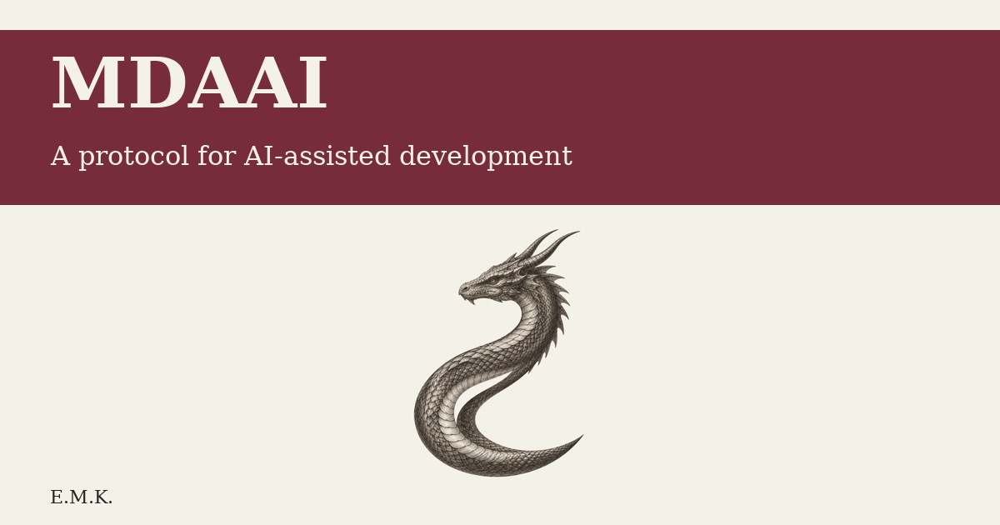
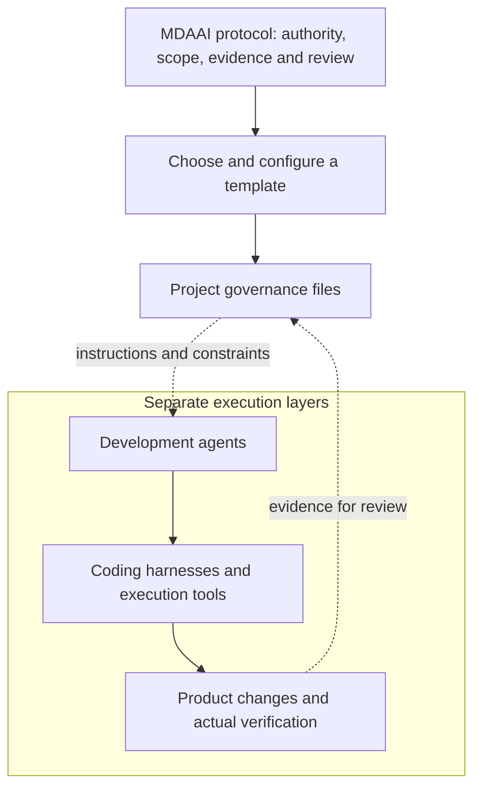
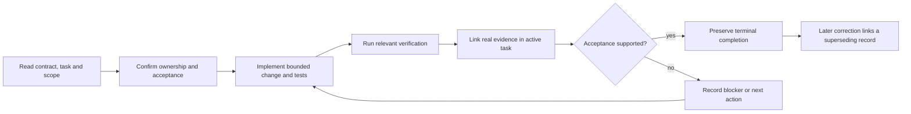

# MDAAI

<p align="center"></p>
<p align="center">

<a href="https://github.com/Eris-Margeta/mdaai/actions/workflows/website.yml"></a>
</p>

**MDAAI is a protocol for governing AI-assisted development.**

To apply the protocol, choose and configure a template. A template supplies the concrete governance files; agents, coding harnesses and execution tools are separate layers.

MDAAI defines rules for authority, scope, evidence, history and review. This repository publishes the protocol documentation—not a coding harness or execution system.

**[Choose a template](https://www.mdaai.internet.technology/templates/)** · **[GitHub template index](https://github.com/Eris-Margeta/mdaai-templates)** · **[Submit a template](https://github.com/Eris-Margeta/mdaai-templates/blob/main/CONTRIBUTING.md)**

To propose a listing, follow the catalog’s contribution requirements and [submit a pull request to the index](https://github.com/Eris-Margeta/mdaai-templates/pulls). Templates are reviewed before being featured; submitting does not guarantee admission.

By **Eris Margeta Kurdali** · [Read the protocol](https://www.mdaai.internet.technology/) · [Watch the overview](https://www.mdaai.internet.technology/#explainer) · [Rights and inherited notices](LICENSE)

## Read the protocol

| Guide | What it explains |
|:--|:--|
| [MDAAI](https://www.mdaai.internet.technology/) | Definition, continuity, instructions vs enforcement |
| [Repository structure](https://www.mdaai.internet.technology/repository-structure/) | Required/optional/conditional files and information owners |
| [How files work together](https://www.mdaai.internet.technology/how-files-work-together/) | Reading order, read/write responsibilities and recovery |
| [Task lifecycle](https://www.mdaai.internet.technology/task-lifecycle/) | Ordinary task evidence, blocked vs deferred, terminal corrections |
| [Original MDAAI](https://www.mdaai.internet.technology/mdaai-1/) | Work Orders, corrective records, decisions and the editing-rule conflict |
| [MDAAI 2.0](https://www.mdaai.internet.technology/mdaai-2/) | Smaller portable core, fresh registry and project-by-project adoption |

## Two template families, one protocol

| | Original MDAAI | MDAAI 2.0 |
|:--|:--|:--|
| Entry | Template instructions and governance protocols | Root `AGENTS.md` |
| Scope and sequence | Project Elaboration | Project Elaboration |
| Work state | Work Orders and their registry | `TASKS.json`, the single canonical task-state owner |
| Records | WO / CWO / ADR / checkpoint / knowledge artifacts | Durable record when task and evidence alone are insufficient |
| Completion | Records and expected verification | Actual acceptance evidence; preserve terminal results |
| Migration | Reconcile original WO editing-rule conflict | Fresh registry, completed history, pilot acceptance and rollback |

> [!NOTE]
> MDAAI 2.0 reduces routine paperwork, **not accountability**. Local permissions and stronger inherited rules still apply. A structural checker is not semantic acceptance or proof of live adoption.

## From protocol to project governance



### Portable MDAAI 2.0 core

The following inventory belongs to the **MDAAI 2.0 template family**, not to every implementation of the protocol. Configure the selected template for your project before use.

```text
AGENTS.md                                      operating contract
PROJECT-INTERNAL/
├── GOVERNANCE/
│   ├── AUTHORITY.md                            permissions and boundaries
│   ├── ENGINEERING.md                          engineering obligations
│   ├── EVIDENCE.md                             evidence and acceptance
│   ├── REASONING.md                            coordination and reasoning
│   └── RECORDS.md                              history and supersession
└── MANAGEMENT/
    ├── PROJECT-ELABORATION.md                   scope and sequence
    └── TASKS.json                              task state and next action
```

Architecture and other durable records are conditional. Product, test and evidence paths are project-selected, not extra universal core files.

## An ordinary task lifecycle



These are relationships, not invented registry states. Blocked and deferred are different dispositions. An unavailable tool must never be replaced with simulated success.

## Having difficulty reading? Watch the 91-second overview.

[](https://www.mdaai.internet.technology/#explainer)

Narration and captions offer another way to explore the two template families. In this existing overview, “2.0” refers to the MDAAI 2.0 template family; its file inventory is not a universal requirement of the protocol. The website has native controls and English captions; GitHub shows a linked poster. The existing video is 91.3 seconds.

[MP4](website/assets/media/mdaai-original-and-2.mp4) · [SRT captions](website/assets/media/mdaai-original-and-2.srt) · [WebVTT](website/assets/media/mdaai-original-and-2.vtt) · [Narration script](docs/publication/video-script.md)

## Publication source

```text
website/
├── content.json              curated seven-page documentation
├── provenance.json           reviewed content/asset digests and logical source refs
├── build.py / seo.py          portable build and canonical metadata
├── check.py                  route, content, provenance and metadata regressions
├── check_clipboard.cjs        clipboard timeout and honest failure guards
├── assets/                   approved design, social image, icons, final media
└── serve.py                  loopback-only preview
docs/publication/             provenance and media explanation
licenses/template-MIT.txt     unchanged inherited template notice
Dockerfile / nginx.conf       unprivileged production service
.github/workflows/website.yml actual build and container checks
```

### Build and verify

The exact development/build/test interpreter is Python 3.13.14, shared with the public template repositories in `.python-version`. The `just` commands use its official Alpine container, so Docker is required; `just test` also needs Node.js for the dependency-free JavaScript checks. No Python/Node package installs are needed for an ordinary build. Direct script invocation requires that same interpreter. The production runtime is unprivileged Nginx, not Python.

Browser regressions use the pinned TesterArmy packages in `package-lock.json` and require Node.js 22.12.0 or newer. Install them with `npm ci`, install Chromium with `npx playwright install chromium`, then run `E2E_BASE_URL=http://127.0.0.1:8771 npm run test:e2e` against the production-equivalent container below. These browser-test dependencies are separate from an ordinary static build.

```sh
just build
just test
python3 -B website/serve.py --port 8771
```

Production-equivalent container:

```sh
docker build --platform linux/amd64 -t mdaai-docs .
docker run --rm -p 127.0.0.1:8771:8080 mdaai-docs
```

Only generated output is served. The container has a real `/healthz`, genuine unknown-route 404s and video byte-range support. Host canonicalization belongs to the CDN edge, **not site code**.

### Literal template catalog

[Browse the templates](https://www.mdaai.internet.technology/templates/) · [Public template repository](https://github.com/Eris-Margeta/mdaai-templates). Two initial families, 105 literal files, reviewed before adoption. Template versions and protocol identities are distinct; updates require explicit downstream adoption.

The default build stays offline. `just templates-sync` explicitly imports the immutable reviewed feed; `just build-with-templates` adds revalidated read-only text previews and downloads from that local cache without network access. `just build` restores the ordinary remote-link publication. [Pin, security bounds and review procedure](docs/publication/templates.md).

### Source boundary and rights

Instantiated from the canonical first-generation template with clean Git history. Reviewed sources were hash-checked before export. Private source packages, archives, operational reports, rejected media drafts, runtime data and private Git history are excluded.

Portable provenance verifies reviewed publication bytes and reference coverage; it does not fetch private sources. [Provenance boundary](docs/publication/provenance.md).

**No blanket open-source reuse license is claimed.** Template-derived material retains its existing MIT rights; other original publication files have no additional reuse grant. [Rights and inherited notices](LICENSE).

---
MDAAI documentation by **Eris Margeta Kurdali**. Approved website creation/footer attribution: **TEJL** — [tejl.hr](https://tejl.hr/) · [tejl.com](https://tejl.com/).

For any agent system, point its entry instructions to the nearest AGENTS.md. Applicable parent and scoped governance files are cumulative.
